# Project 3 Report

Name: Kyle Fiori

Class: CMSC-430

Assignment: Project 4

Date 2024-08-06

## Approach

I following the recommended approach to a 'T' with this project. I stated with the skeleton and adding all additional tokens and semantic rules from Project2. Once completing these I tested the "valid" tests that were included with the materials. There were some warning at compilation but they had no affect on the output so I ignored them for the time being. I began to tackle the new rules 1 by 1. At first I felt a little "in the dark" about how the given functions worked in types.cc. After trial and error I began to get the rules 1 by 1. The biggest issue was figuring out when a function needed to return a type and be void. The next holdup was figuring out how to catch duplicate variables all the way at the end. This simply involved adding a new method at the end of parser.y to pass the correct information to a function in types.cc. Once implemented I cleared up some of the extra warnings with the compile.

## Testing

I ran every test case given with the project that added additional features. The test results are as seen below:

<table>
<tr>
<th>Test#</th>
<th>Description</th>
<th>Screenshot</th>
<th>Pass/Fail</th>
</tr>
<tr>
<td>1</td>
<td>
<ul>
<li>Single semantic error expected</li>
                <li>Features tested:
                    <ul>
                        <li>List with mismatching element types</li>
                    </ul>
                </li>
            </ul>
        </td>
        <td>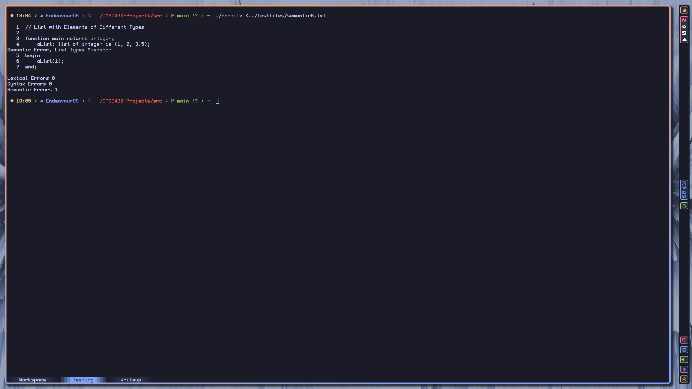</td>
        <td>Pass</td>
    </tr>
    <tr>
        <td>2</td>
        <td>
            <ul>
                <li>Single semantic error expected</li>
                <li>Features tested:
                    <ul>
                        <li>List initialization with different element types</li>
                    </ul>
            </ul>
        </td>
        <td>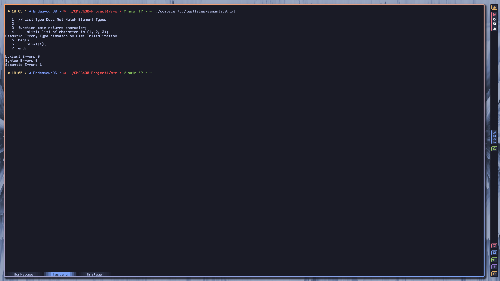</td>
        <td>Pass</td>
    </tr>
    <tr>
        <td>3</td>
        <td>
            <ul>
                <li>single semantic error expected</li>
                <li>Features tested:
                    <ul>
                        <li>List reference with non integer subscript</li>
                    </ul>
            </ul>
        </td>
        <td>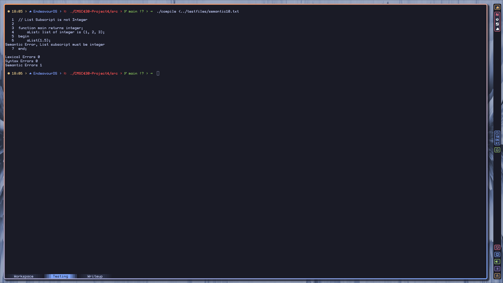</td>
        <td>Pass</td>
    </tr>
    <tr>
        <td>4</td>
        <td>
            <ul>
                <li>Single semantic error expected</li>
                <li>Features tested:
                    <ul>
                        <li>Relational operator where character is compared to numeric type</li>
                    </ul>
            </ul>
        </td>
        <td>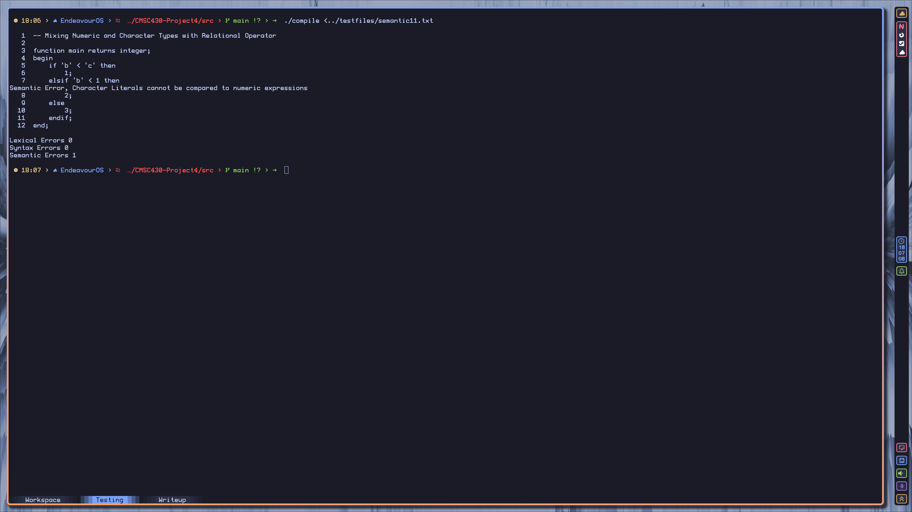</td>
        <td>Pass</td>
    </tr>
    <tr>
        <td>5</td>
        <td>
            <ul>
                <li>Two semantic errors expected</li>
                <li>Features tested:
                    <ul>
                        <li>Arithmetic negation used on a character</li>
                        <li>Character used with exponentiation operator</li>
                    </ul>
            </ul>
        </td>
        <td>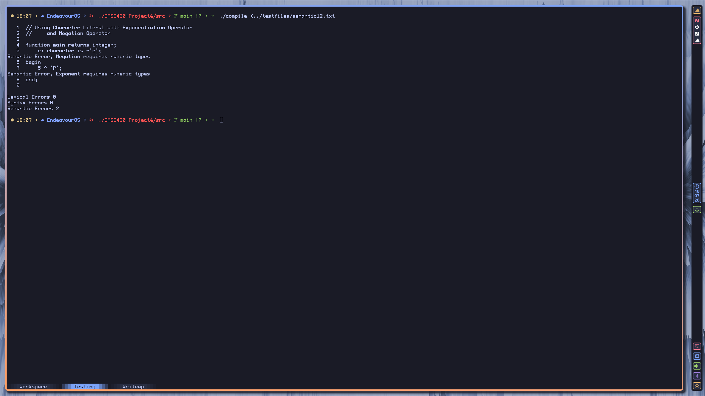</td>
        <td>Pass</td>
    </tr>
    <tr>
        <td>6</td>
        <td>
            <ul>
                <li>Single semantic error expected</li>
                <li>Features tested:
                    <ul>
                        <li>modulo operator used with real type</li>
                    </ul>
            </ul>
        </td>
        <td>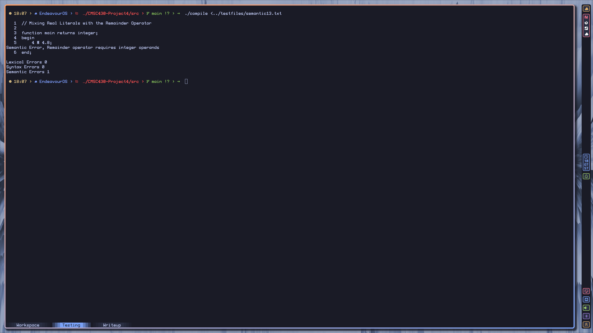</td>
        <td>Pass</td>
    </tr>
    <tr>
        <td>7</td>
        <td>
            <ul>
                <li>Single semantic error expected</li>
                <li>Features tested:
                    <ul>
                        <li>If statement return types mismatching</li>
                    </ul>
            </ul>
        </td>
        <td></td>
        <td>Pass</td>
    </tr>
    <tr>
        <td>8</td>
        <td>
            <ul>
                <li>Successful compilation expected</li>
                <li>Features tested:
                    <ul>
                        <li>Non numeric list used on fold statement</li>
                    </ul>
            </ul>
        </td>
        <td>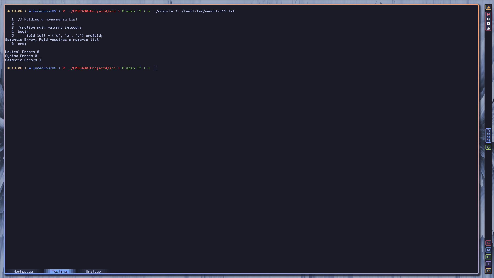</td>
        <td>Pass</td>
    </tr>
    <tr>
        <td>9</td>
        <td>
            <ul>
                <li>Single semantic error expected</li>
                <li>Features tested:
                    <ul>
                        <li>Narrowing on variable initialization</li>
                    </ul>
            </ul>
        </td>
        <td>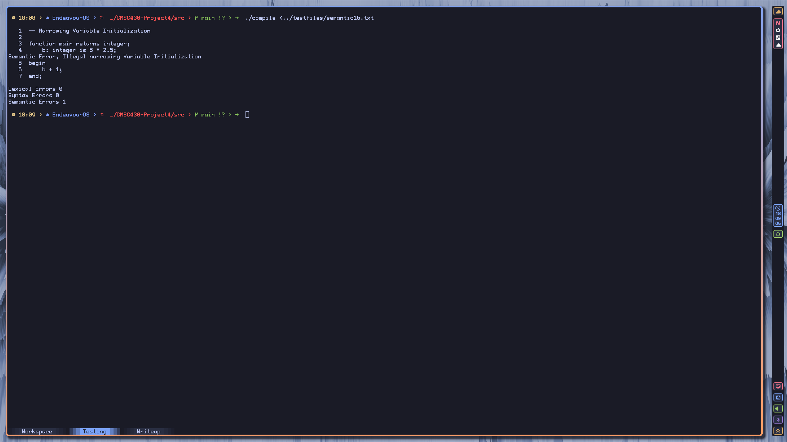</td>
        <td>Pass</td>
    </tr>
    <tr>
        <td>10</td>
        <td>
            <ul>
                <li>Single semantic error expected</li>
                <li>Features tested:
                    <ul>
                        <li>Narrowing on function return</li>
                    </ul>
            </ul>
        </td>
        <td>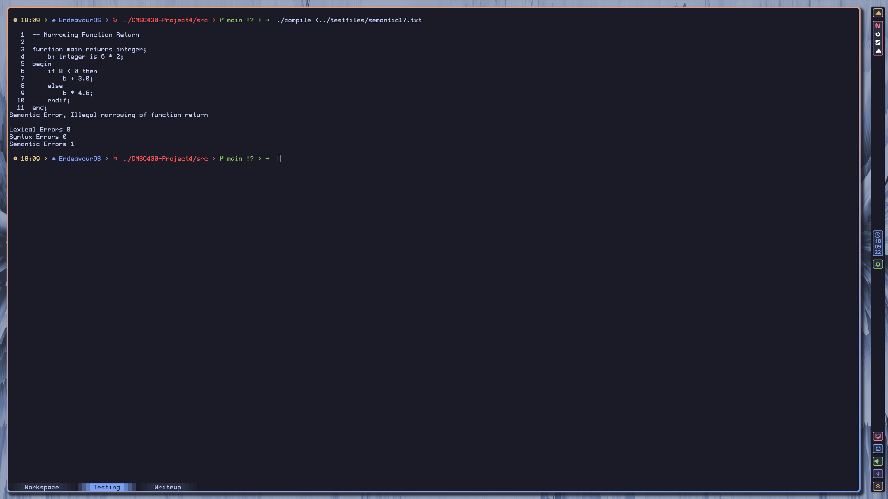</td>
        <td>Pass</td>
    </tr>
    <tr>
        <td>11</td>
        <td>
            <ul>
                <li>Two semantic errors expected</li>
                <li>Features tested:
                    <ul>
                        <li>Duplicate initialization on variables</li>
                    </ul>
            </ul>
        </td>
        <td>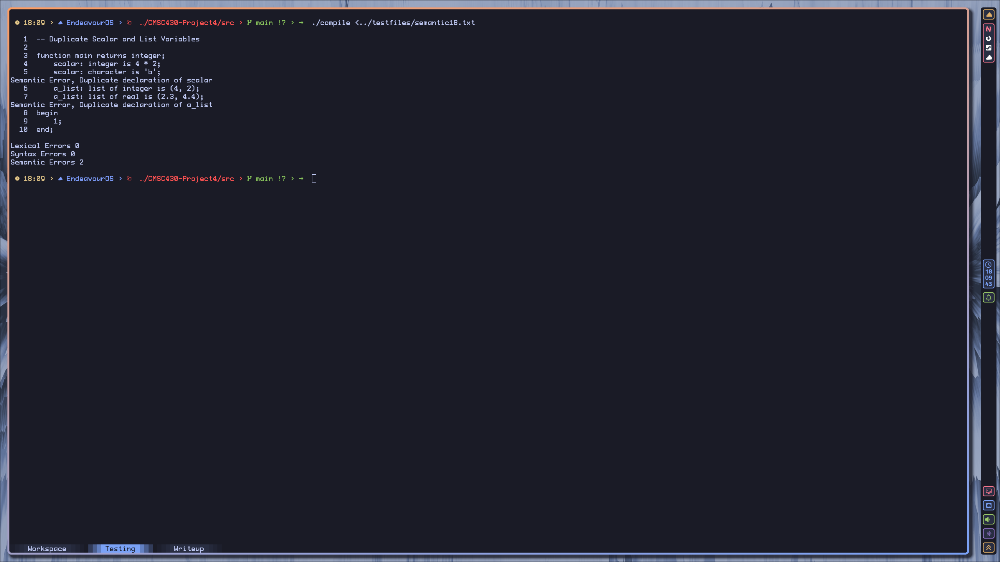</td>
        <td>Pass</td>
    </tr>
    <tr>
        <td>12</td>
        <td>
            <ul>
                <li>Seven semantic errors expected</li>
                <li>Features tested:
                    <ul>
                        <li>Narrowing on variable initialization</li>
                        <li>List initialization type doesn't match list</li>
                        <li>type mismatch on variable initialization</li>
                        <li>Fold with non numeric list</li>
                        <li>referencing undeclared scalar</li>
                        <li>list with differing element types</li>
                        <li>type mismatch on when statement return</li>
                    </ul>
            </ul>
        </td>
        <td>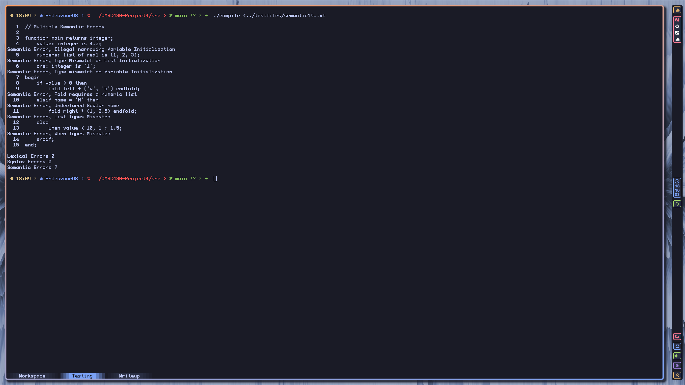</td>
        <td>Pass</td>
    </tr>
</table>

## Lessons Learned

This project gave me a better understanding of error checking and reporting within a compiler (or at least how to implement it with bison). As previous projects I think the most valuable skill gained was the ability to analyze a given code base, determine how it process information, and implementing new features to it. Overall I think this class did an okay job of introducing compilers. Enough hold a conversation and use the correct jargon about them. If I was not using Flex and Bison I think I would be pretty lost on implementing one myself. I'm not sure if these tools are industry standard or not for creating new compilers.
